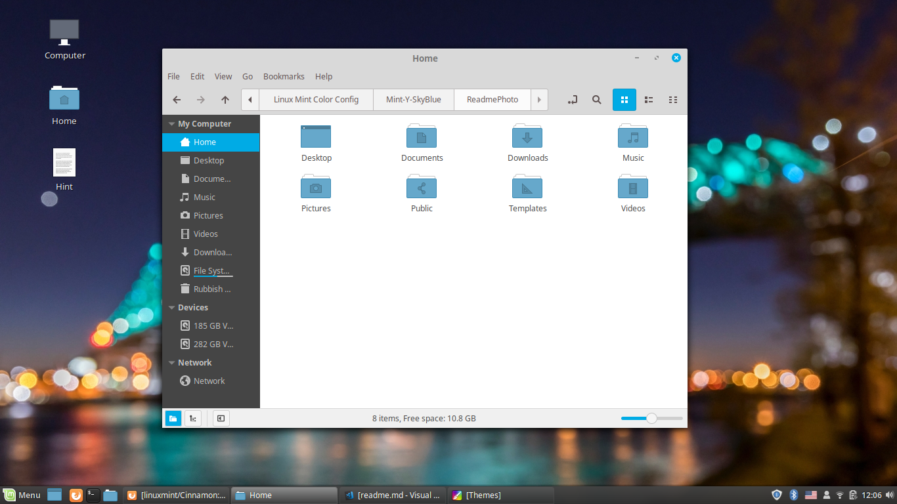
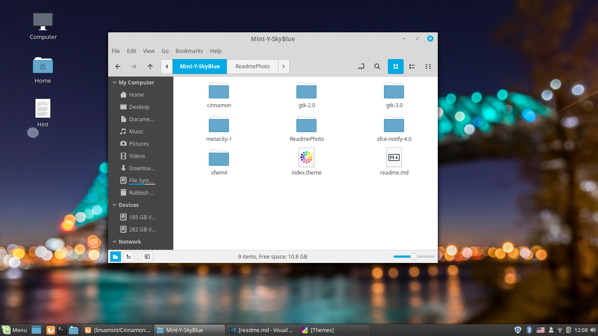

# Linux Mint-Y SkyBlue Theme
Make your linux more colorful with sky blue theme that based on Linux Mint Mint-Y Theme on Linux Mint 19.0 Tessa
Editing from Linux Mint Mint-Y theme on my computer Supporting GTK3.0 GTK2.0. It only Control and Windows boarder the logo is not now.

## Screenshot
Make a Linux Mint Windows button to deepskyblue and other notify,click,progress bar too
with deepskyblue and other shade of skyblue

## To Downloading
Download The Zip File Mint-Y-Skyblue at [Mint-Y-SkyBlue.zip](Mint-Y-SkyBlue.zip)
Extract file you will get a Mint-Y-Skyblue Folder 

* Go to your Linux File System /usr/share/themes
* Copy Your folder Mint-Y-Skyblue to this folder with root or Administrator Permission that you can access with right click if you using Linux Mint

## Note
This is not a Stable Version. It will be more soon. Thank you for using. It will go to the the Linux-Mint Theme store and GNOME Desktop Library soon.

## For The Native Linux Mint Mint-Y Theme
[Linux Mint Theme GitHub](https://github.com/linuxmint/mint-themes)
