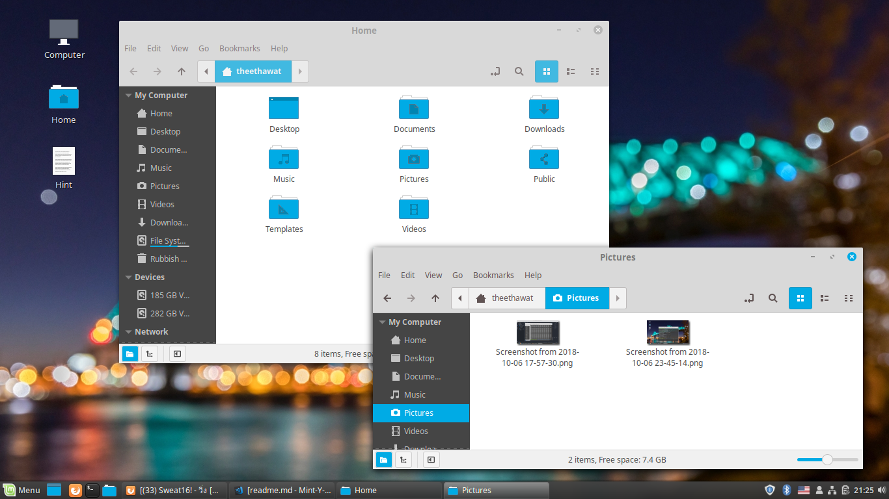

# Linux Mint-Y Sky Blue Theme

Make your linux more colorful with sky blue theme that based on Linux Mint Mint-Y Theme on Linux Mint 19.0 Tarra
Editing from Linux Mint Mint-Y theme on my computer Supporting GTK3.0 GTK2.0 . Control windows button, Windows Border and Icons

## Screenshot

Make a Linux Mint Windows button to deepskyblue and other notify,click,progress bar too
with deepskyblue and other shade of skyblue

With Icons

## For Coding

This Code are in Theme but for icons is in folder Mint-Y-Skyblue-icon

## Note

This is not a Stable Version. It will be more soon. Thank you for using. It will go to the the Linux-Mint Theme store and GNOME Desktop Library soon.

## For The Native Linux Mint Mint-Y Theme

[Linux Mint Theme GitHub](https://github.com/linuxmint/mint-themes)
